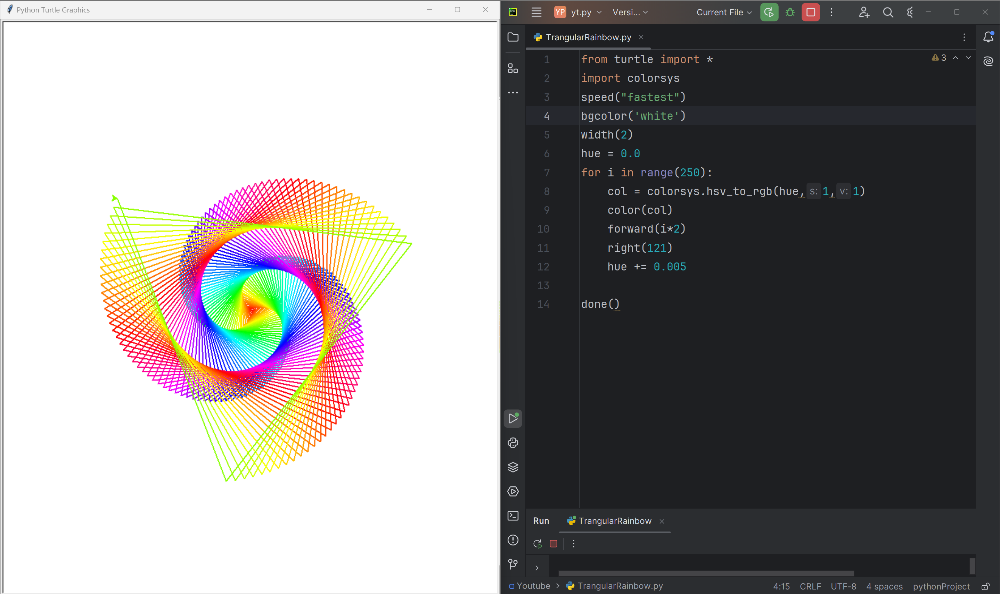

# Trangular Spiral

This code uses the Python Turtle library to create a stunning, swirling pattern that appears to pull the viewer in, like a vortex. The pattern is formed by drawing a series of connected lines with increasing lengths, with each line being drawn in a different color from a predefined palette. The turtle module is used to control the turtle's movements and appearance.

# Tutorial is available on youtube channel 
click on the link to see :- ([Open in Youtube]())

# Screenshot

Trangular Spiral

# Features
Generates a beautiful, colorful spiral pattern with a smooth, gradient-like transition between colors
Uses the Turtle graphics library for a retro, nostalgic feel
Adjustable parameters for customization and experimentation
Perfect for art, design, and coding enthusiasts alike

# Run
To run this code, save it to a file with a .py extension (e.g., spiral.py) and execute it using Python (e.g., python Trangular_spiral.py). This will launch a window displaying the Rainbow Vortex pattern.

# License
This code is licensed under the MIT License. Feel free to modify, distribute, and use it for any purpose.

# snake.coding
We create a project each 4 days with voting on our <a href="https://youtube.com/@snakecoding_12" target="_blank">Youtube</a> channel.
You can vote for upcoming projects on our channel **community** page :wink:

